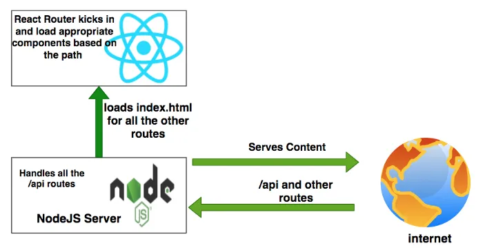
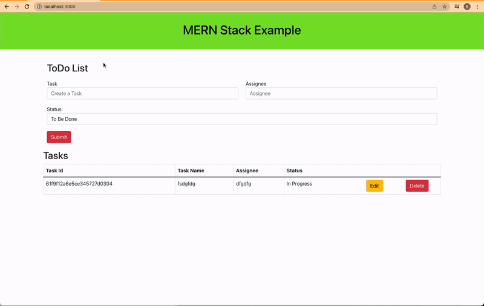
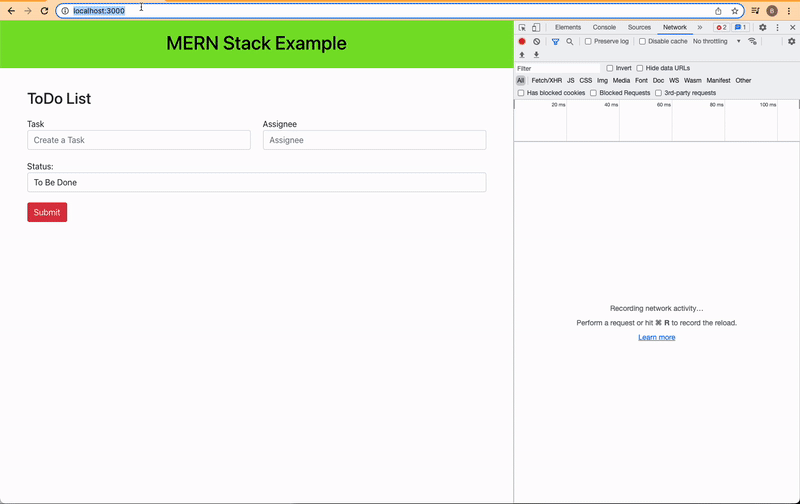
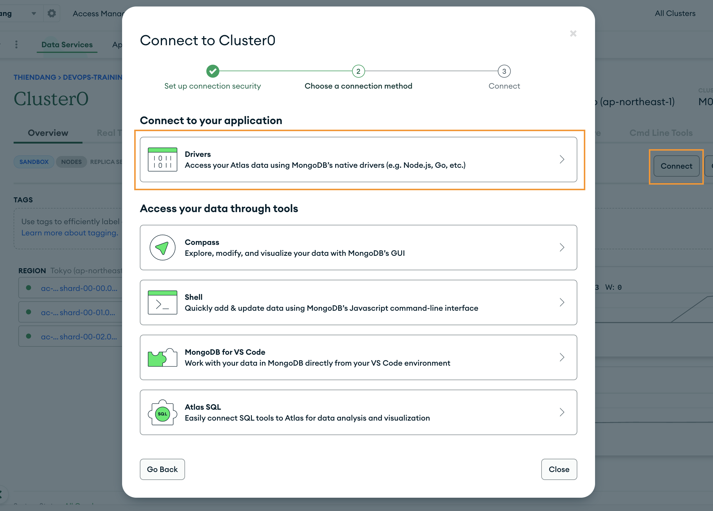

# How To Develop, Build, Dockerize and Run MERN Stack on Docker Compose — Typescript Version

Date Added: September 21, 2023 12:09 PM

<aside>
💡 This template documents how to review code. Helpful for new and remote employees to get and stay aligned.

</aside>

## **Introduction**

MERN Stack uses four technologies such as MongoDB, Express, React, and NodeJS. React is a javascript library for building web apps and it doesn’t load itself in the browser. We need some kind of mechanism that loads the **index.html** (single page) of React application with all the dependencies(CSS and js files) in the browser. In this case, we are using node as the webserver which loads React assets and accepts any API calls from the React UI app.



If you look at the above diagram all the web requests without the **/api** will go to React routing and the React Router kicks in and loads components based on the path. All the paths that contain **/api** will be handled by the Node server itself.

## **Example Project**

Here is an example of a simple tasks application that creates, retrieves, edits, and deletes tasks. We actually run the API on the NodeJS server and you can use MongoDB to save all these tasks.



As you add users we are making an API call to the nodejs server to store them and get the same data from the server when we retrieve them. You can see network calls in the following video.



Here is a Github link to this project. You can clone it and run it on your machine.

```bash
// clone the project
git clone https://github.com/thiendang/devops-training-mern-stack-typescript.git
// React Code
cd ui
npm install
npm start
// API code
cd api
npm install
npm run dev
```

## **Project Structure**

Let’s understand the project structure for this project. We will have two package.json: one for the **React** and another for **nodejs API**. It’s always best practice to have completely different node_modules for each one. In this way, you won’t get merging issues or any other problems regarding web and server node modules collision. It’s easier to convert your MERN Stack into any other stack later such as replacing the API code with microservices and serving your UI through NGINX web server.

**Project Structure**


If you look at the above project structure, all the React app resides under the **ui** folder and nodejs API resides under the **api** folder.

## ****Set up a MongoDB Atlas****

The core of MongoDB Cloud is [MongoDB Atlas](https://www.mongodb.com/cloud/atlas), a fully managed cloud database for modern applications. Atlas is the best way to run MongoDB, the leading modern database.

[Let’s create your MongoDB Account here](https://account.mongodb.com/account/login). You can either log in with any of your Gmail accounts or you can provide any other email address to create the account.


Once you log in with your account you will see the dashboard below where you can create clusters.


Let’s create a cluster called todo-cluster by clicking on the build a cluster and selecting all the details below.


You can click on **the connect button** to see the details about connecting to the cluster. You need to create a user and Allow Access from anywhere for now.


You can see three ways of connecting to the cluster on the next screen.


We will see all these three ways to connect to the cluster in the next sections.

## ****Create a Database****

We have created a cluster and it’s time to create a database. Click on the collections to create a new database as below.


Click on the Add My Own Data Button to create a new database.


I have given a database name as tasks and the collection name is todos.


You will see the below dashboard once the database is created. We have a database with empty collections.


Let’s insert the first document into the collection by clicking the button `insert document`


## ****Connect With Mongo Compass****

We have seen three ways we can connect to this cluster and read the collections. Let’s connect to the database with Mongo Compass. [The first thing we need to do is to download and install Mongo Compass from this link.](https://www.mongodb.com/try/download/compass)

Let’s get a connection string from the Atlas dashboard as below.


Replace the password with the password that you created above.


Let’s connect to the database with the connection string


You can actually see the same collection in the MongoDB Compass as well.


## ****Building API****

We have configured MongoDB in the previous section, it’s time to build the API. I would recommend you go through two articles posted in the prerequisites section. Let me put those here as well.

Here are the main and controller classes. The index.ts and app.ts files are the main files and starting files of the API and the controller is called from here.

In `app.ts`

```tsx
import * as bodyParser from "body-parser";
import * as express from "express";
import { APILogger } from "./logger/api.logger";
import { TaskController } from "./controller/task.controller";

class App {

    public express: express.Application;
    public logger: APILogger;
    public taskController: TaskController;

    constructor() {
        this.express = express();
        this.middleware();
        this.routes();
        this.logger = new APILogger();
        this.taskController = new TaskController();
    }

    // Configure Express middleware.
    private middleware(): void {
        this.express.use(bodyParser.json());
        this.express.use(bodyParser.urlencoded({ extended: false }));
    }

    private routes(): void {

        this.express.get('/api/tasks', (req, res) => {
            this.taskController.getTasks().then(data => res.json(data));
        });
        
        this.express.post('/api/task', (req, res) => {
            console.log(req.body);
            this.taskController.createTask(req.body.task).then(data => res.json(data));
        });
        
        this.express.put('/api/task', (req, res) => {
            this.taskController.updateTask(req.body.task).then(data => res.json(data));
        });
        
        this.express.delete('/api/task/:id', (req, res) => {
            this.taskController.deleteTask(req.params.id).then(data => res.json(data));
        });

        this.express.get("/", (req, res, next) => {
            res.send("Typescript App works!!");
        });

        // handle undefined routes
        this.express.use("*", (req, res, next) => {
            res.send("Make sure url is correct!!!");
        });
    }
}

export default new App().express;
```

`index.ts`

```tsx
import * as http from "http";
import App from "./app";
import { APILogger } from "./logger/api.logger";
require('dotenv').config()

const port = process.env.PORT || 3070;

App.set("port", port);
const server = http.createServer(App);
server.listen(port);

const logger = new APILogger();

server.on("listening", function(): void {
    const addr = server.address();
    const bind = (typeof addr === "string") ? `pipe ${addr}` : `port ${addr.port}`;
    logger.info(`Listening on ${bind}`, null);
 });

module.exports = App;
```

Here is the controller file which has four methods: `task.controller.ts`

```tsx
import { APILogger } from '../logger/api.logger';
import { TaskService } from '../service/task.service';

export class TaskController {

    private taskService: TaskService;
    private logger: APILogger;

    constructor() {
        this.taskService = new TaskService();
        this.logger = new APILogger()
    }

    async getTasks() {
        this.logger.info('Controller: getTasks', null)
        return await this.taskService.getTasks();
    }

    async createTask(task) {
        this.logger.info('Controller: createTask', task);
        return await this.taskService.createTask(task);
    }

    async updateTask(task) {
        this.logger.info('Controller: updateTask', task);
        return await this.taskService.updateTask(task);
    }

    async deleteTask(taskId) {
        this.logger.info('Controller: deleteTask', taskId);
        return await this.taskService.deleteTask(taskId);
    }
}
```

We are using nodemon for the development phase that speeds up your development. You just need to run this command after installing all dependencies.

```bash
// install dependencies
npm install
// start the server in development phase
npm run dev
```

## **Configure MongoDB In API**

Let’s configure the Mongo Client from our application. The first thing we need to do is to get the connection string.



Make sure you select the right language and the right MongoDB driver version.


Let’s place the connection string and database name in the application properties file as below. You have to URL encode the password if you have any special characters in the password.

Here is the configuration file in which you connect to MongoDB with the help of the connection string. We are using Mongoose to connect with MongoDB for all the queries. Mongoose makes it easy for you to interact with MongoDB.

`db.config.ts`

```tsx
import * as Mongoose from "mongoose";
require('dotenv').config()

let database: Mongoose.Connection;

export const connect = () => {

    const url = process.env.MONGO_CONNECTION_STRING;
    console.log("from connect: process.env.MONGO_CONNECTION_STRING :::",process.env.MONGO_CONNECTION_STRING)

    if (database) {
        return;
    }
    
    Mongoose.connect(url, {
        useNewUrlParser: true,
        useFindAndModify: true,
        useUnifiedTopology: true,
        useCreateIndex: true,
    });
    
    database = Mongoose.connection;

    database.once("open", async () => {
        console.log("Connected to database");
    });
      
    database.on("error", () => {
        console.log("Error connecting to database");
    });

};

export const disconnect = () => {
    
    if (!database) {
      return;
    }
    
    Mongoose.disconnect();

    database.once("close", async () => {
        console.log("Diconnected  to database");
    });

};
```

The next thing we should define is the schema for the database model as below.

`task.model.ts`

```tsx
import { model, Schema, Model, Document } from 'mongoose';

export interface ITask extends Document {
    task: string;
    assignee: string;
    status: string;
    createDate: Date, 
    updatedDate: Date;
    createdBy: string;
    updatedBy: string;
    timestamps?: {};
}

const TaskSchema: Schema = new Schema({
    task: { type: String, required: true },
    assignee: { type: String, required: true },
    status: { type: String, required: true },
    createDate: { type: Date, default: Date.now },
    updatedDate: { type: Date, default: Date.now },
    createdBy: { type: String, required: false },
    updatedBy: { type: String, required: false },
    timestamps: { createDate: Date, updatedDate: Date}}
);

export const TaskModel: Model<ITask> = model<ITask>('tasks', TaskSchema);
```

Finally, we have a repository class as below using the above model for the CRUD operations.

`task.repository.ts`

```tsx
import { connect, disconnect } from "../config/db.config";
import { TaskModel } from '../model/task.model';
import { APILogger } from '../logger/api.logger';

export class TaskRepository {

    private logger: APILogger;

    constructor() {
        connect();
        this.logger = new APILogger()
    }

    async getTasks() {
        const tasks = await TaskModel.find({});
        console.log('tasks:::', tasks);
        return tasks;
    }

    async createTask(task) {
        let data = {};
        try {
            data = await TaskModel.create(task);
        } catch(err) {
            this.logger.error('Error::' + err);
        }
        return data;
    }

    async updateTask(task) {
        let data = {};
        try {
            data = await TaskModel.updateOne(task);
        } catch(err) {
            this.logger.error('Error::' + err);
        }
        return data;
    }

    async deleteTask(taskId) {
        let data: any = {};
        try {
            data = await TaskModel.deleteOne({_id : taskId});
        } catch(err) {
            this.logger.error('Error::' + err);
        }
        return {status: `${data.deletedCount > 0 ? true : false}`};
    }
}
```

## ****Externalize the Environment Variables****

We have seen how to configure your MongoDB connection in the API. We need to store this kind of configuration outside of your app so that you can build once and deploy it in multiple environments with ease.

The first step is to install this library `npm install dotenv` and put the .env file at the root location of the project

We just need to put this line `require('dotenv').config()` as early as possible in the application code as in the `index.ts` file.

```tsx
import * as http from "http";
import App from "./app";
import { APILogger } from "./logger/api.logger";
require('dotenv').config()

const port = process.env.PORT || 3080;

App.set("port", port);
const server = http.createServer(App);
server.listen(port);

const logger = new APILogger();

server.on("listening", function(): void {
    const addr = server.address();
    const bind = (typeof addr === "string") ? `pipe ${addr}` : `port ${addr.port}`;
    logger.info(`Listening on ${bind}`, null);
 });

module.exports = App;
```

Let’s define the configuration class where it creates a connection with the connection string we just copied from the Atlas Dashboard. We are fetching the Mongo connection string with the dotenv library and connecting it to MongoDB with Mongoose. We are exposing two functions from this file connect and disconnect.

`db.config.ts`

```tsx
import * as Mongoose from "mongoose";
require('dotenv').config()

let database: Mongoose.Connection;

export const connect = () => {

    const url = process.env.MONGO_CONNECTION_STRING;
    console.log("from connect: process.env.MONGO_CONNECTION_STRING :::",process.env.MONGO_CONNECTION_STRING)

    if (database) {
        return;
    }
    
    Mongoose.connect(url, {
        useNewUrlParser: true,
        useFindAndModify: true,
        useUnifiedTopology: true,
        useCreateIndex: true,
    });
    
    database = Mongoose.connection;

    database.once("open", async () => {
        console.log("Connected to database");
    });
      
    database.on("error", () => {
        console.log("Error connecting to database");
    });

};

export const disconnect = () => {
    
    if (!database) {
      return;
    }
    
    Mongoose.disconnect();

    database.once("close", async () => {
        console.log("Diconnected  to database");
    });

};
```

## ****Building UI****

Once you create the separate folder for React code you need to start with the following command to scaffold the React structure with the help of React CLI. We will not build the entire app here instead we will go through important points here. You can clone the entire GitHub Repo and check the whole app.


## ****Dockerize MERN Stack****

Docker is an enterprise-ready container platform that enables organizations to seamlessly build, share, and run any application, anywhere. Almost every company is containerizing its applications for faster production workloads so that they can deploy anytime and sometimes several times a day. There are so many ways we can build a MERN Stack. One way is to dockerize it and create a docker image so that we can deploy that image any time or sometimes several times a day.

We have seen how to build UI and API and Let’s package the App with this information.

We use the multi-stage builds for efficient docker images. Building efficient Docker images are very important for faster downloads and lesser surface attacks. In this multi-stage build, building a React app and putting those static assets in the build folder is the first step. The second step involves building the API. Finally, the third step involves taking those static build files and API build and serving the React static files through the API server.

We need to update the server.js file in the NodeJS API to let Express know about the React static assets and send the index.html as a default route. 

```tsx
private middleware(): void {
    ...
    this.express.use(express.static(path.join(__dirname, '../ui/build')));
}
```

```tsx
private routes(): void {
	this.express.get("/", (req, res, next) => {
      res.sendFile(path.join(__dirname, '../ui/build/index.html'));
  });
}
```

Let’s build an image with the Dockerfile. Here are the things we need for building an image.

### **Stage 1**

- Start from the base image `node:14-slim`
- There are two package.json files: one is for the nodejs server and another is for React UI. We need to copy these into the Docker file system and install all the dependencies.
- We need this step first to build images faster in case there is a change in the source later. We don’t want to repeat installing dependencies every time we change any source files.
- Copy all the source files.
- Install all the dependencies.
- Run `npm run build` to build the React App and all the assets will be created under `build` a folder within the ui folder.

### **Stage 2**

- Start from the base image `node:14-slim`
- Copy the nodejs package.json into **./api** folder
- Install all the dependencies
- Finally, copy the server.js into the same folder

### **Stage 3**

- Start from the base image `node:14-slim`
- Copy all the built files from UI Build
- Copy all the built files from API Build
- Finally, run this command `node api.bundle.js`

Here is the complete Dockerfile for the entire build.

```docker
# Stage1: UI Build
FROM node:14-slim AS ui-build
WORKDIR /usr/src
COPY ui/ ./ui/
RUN cd ui && npm install && npm run build

# Stage2: API Build
FROM node:14-slim AS api-build
WORKDIR /usr/src
COPY api/ ./api/
RUN cd api && npm install && ENVIRONMENT=production npm run build
RUN ls

# Stage3: Packagign the app
FROM node:14-slim
WORKDIR /root/
COPY --from=ui-build /usr/src/ui/build ./ui/build
COPY --from=api-build /usr/src/api/dist .
RUN ls

EXPOSE 3080

CMD ["node", "api.bundle.js"]
```

Let’s build the image with the following command.

```bash
// build the image
docker build -t mern-image .
// check the images
docker images
```

### ***Running The App on Docker***

Once the Docker image is built. You can run the image with the following command.

```bash
docker run -d -p 3080:3080 --name mern-stack mern-image
```

You can access the application on the web at this address [http://localhost:3080.](http://localhost:3080./)

## ****Running on Docker Compose****

Docker Compose is really useful when we don’t have the development environment setup on our local machine to run all parts of the application to test or we want to run all parts of the application with one command. For example, if you want to run NodeJS REST API and MongoDB database on different ports and need a single command to set up and run the whole thing. You can accomplish that with Docker Compose.

### **What is Docker Compose**

Docker-compose is a tool that is used for multi-container applications in a single host. We can run multi containers as services in a single host with the help of **docker-compose.yaml**.

Once we install docker-compose, basically, we need to follow these three steps

- Define Dockerfile for the service/container
- Define **docker-compose.yaml** file with all the services, ports, and other details
- Run this command ***docker-compose up***

Here are some useful commands

```bash
// create and start containers
docker-compose up
// start services with detached mode
docker-compose -d up
// start specific service
docker-compose up <service-name>
// list images
docker-compose images
// list containers
docker-compose ps
// start service
docker-compose start
// stop services
docker-compose stop
// display running containers
docker-compose top
// kill services
docker-compose kill
// remove stopped containers
docker-compose rm
// stop all contaners and remove images, volumes
docker-compose down
```

### **API**

It’s easier if we define a Dockerfile for each service. Here is the Dockerfile ****for the node express API and the following are the steps. I named this file `Dockerfile`

```docker
# Pull the Node image from Docker Hub
FROM node:14-slim

# Setting Working Directory
WORKDIR /usr/app

# Copying only package.json
COPY package*.json ./

# Install Dependencies
RUN npm install

# Copy rest of the code to container
COPY . .

EXPOSE 3080

# Run the API on Nodemon
CMD ["npm", "run", "dev"]
```

1. We are starting from the base image **node:14-slim.**
2. Set the working directory as **/usr/app.**
3. copy the **package.json** to install all the dependencies
4. Install all the dependencies
5. We need to put this expose command for documentation purposes so that other developers know this service runs on port 3080.
6. Finally, we run the command `npm run dev`

For the API, we are running this command `npm run dev` which in turn runs this command `nodemon ./server.js localhost 3080.` Since it’s a development environment we are using nodemon which listens for the changes in files and restart the server automatically.

### ****UI****

Here is the Dockerfile ****for the React UI and the following are the steps. I named this file `Dockerfile` as well.

```docker
# Pull the Node image from Docker Hub
FROM node:14-slim

# Setting Working Directory
WORKDIR /usr/app

# Copying only package.json
COPY package*.json ./

# Install Dependencies
RUN npm install

# Copy rest of the code to container
COPY . .

EXPOSE 3000

# Run the React app
CMD ["npm", "start"]
```

1. We are starting from the base image **node:104-slim.**
2. Set the working directory as **/usr/app**
3. copy the **package.json** to install all the dependencies
4. We need to install all the dependencies
5. Exposing the port 3000
6. Finally, we run the command `npm start`

For the UI, we are running this command `npm start`which in turn runs this command `react-scripts start`Since it’s a development environment we are using React CLI which listens for the changes in files and restart the dev server automatically.

### **Docker Compose File**

Finally, let’s look at the `docker-compose` file here. Since we need to run React on port **3000,** express API on port **3080,** and MongoDB on port **27017** we need to define three services: **ui, API, and db.** We defined one network for the isolation and a volume to persist the data even after restarts.

If you look at the above file we defined three services each has its own docker file. The most important thing here is the volumes part we need to mount the whole part of the application and node_modules folder as well. **We need to mount the node_modules folder because the volume is not mounted during the build.**

Since the command `react-scripts start` opens the browser when we run we have to add this `stdin_open: true` in the docker-compose file to start in an interactive mode.

Let’s run the following steps to run the whole setup in the development mode.

```bash
// build with no cache
docker-compose build --no-cache
// start the services
docker-compose up
// list the services
docker-compose ps
// list the containers
docker ps
// stop services
docker-compose stop
```

If everything goes well, it should build the same way as below.


Here is the command `docker-compose up`


You can list the container with these commands once the above command runs.


You can even explore this on the Docker Desktop GUI tool as below.


### ***Communication Between Services***

Now the services are running on the local network and ***these services should be reachable by the service name.*** By default Compose sets up a single [network](https://docs.docker.com/engine/reference/commandline/network_create/) for your app. Each container for a service joins the default network and is both *reachable* by other containers on that network, and *discoverable* by them at a hostname identical to the container name.

### **UI-Service-Communication**

We know we should use a proxy in the development environment on the local machine. We should have the service name in the ***proxy*** object in ***package.json*** instead of the localhost on line **number 24**.


### **Service-Mongo-Communication**

We know that we have to externalize all our environment variables using the dotenv library. Since the MongoDB service name is mongo-db, you should use the below connection string.

```bash
MONGO_CONNECTION_STRING=mongodb://mongo-db:27017
```

### **Summary**

- Docker-compose is a tool that is used for multi-container applications in a single host.
- Docker Compose is really useful when we don’t have the development environment setup on our local machine to run all parts of the application to test
- You can run the whole development environment with one command `docker-compose up`
- You should define a separate Dockerfile for development for services. In the above case one for React UI and one for Node API.
- We need to mount volumes for the application code and node_modules since volumes are not mounted during the build.
- By default Compose sets up a single [network](https://docs.docker.com/engine/reference/commandline/network_create/) for your app. Each container for a service joins the default network and is both *reachable* by other containers on that network, and *discoverable* by them at a hostname identical to the container name.
- Since the command `react-scripts start` opens the browser when we run we have to add this `stdin_open: true` in the docker-compose file to start in an interactive mode.
- If the container_name is node-api you should call the api with **[http://node-api:3080/api](http://node-api:3080/api)**
- You need to define this entry for the proxy object of ***package.json*** instead of **[http://localhost:3080/api](http://node-api:3080/api)**
- If you want to install any new dependency while developing the project you need to rebuild the docker-compose.